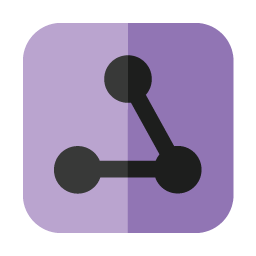

Simple Network
========



### Basic Usage
```kotlin
// GET
// -----
// Asynchronously execute the network request
Rest.get("https://sample-api-jkl.herokuapp.com/users").enqueue({
    Log.i("DONE", "All Users: ${it.bodyAsString}")
})

// POST
// -----
val net = Rest.post("https://sample-api-jkl.herokuapp.com/users", FormDataBody(
        mapOf(
            "age" to FormItem.Text("23"),
            "name" to FormItem.Text("Jake")
        )
    )
)
// Asynchronously execute the network request
net.enqueue({
    Log.i("DONE", "Net Complete ${it.bodyAsString}")
})
```

```kotlin
// GET with Lambda
// -----
fun getUsers(onDone: (userData: String?) -> Unit) {
    Rest.get("https://sample-api-jkl.herokuapp.com/users").enqueue({
        onDone(it.bodyAsString)
    })
}
```
Download
--------
Currently not on Bintray/Maven, feel free to download the aar directly.

### Setup AAR
Download the release AAR and copy to the libs folder: `app/libs/`
```groovy
// app-level build.gradle
repositories {
    flatDir {
        dirs 'libs'
    }
}

dependencies {
  implementation(name: 'network-release', ext: 'aar')
}
```
Finally sync Gradle!

License
-------

    Copyright 2020 Jacob Lewis
    
    Licensed under the Apache License, Version 2.0 (the "License");
    you may not use this file except in compliance with the License.
    You may obtain a copy of the License at
    
       http://www.apache.org/licenses/LICENSE-2.0
    
    Unless required by applicable law or agreed to in writing, software
    distributed under the License is distributed on an "AS IS" BASIS,
    WITHOUT WARRANTIES OR CONDITIONS OF ANY KIND, either express or implied.
    See the License for the specific language governing permissions and
    limitations under the License.